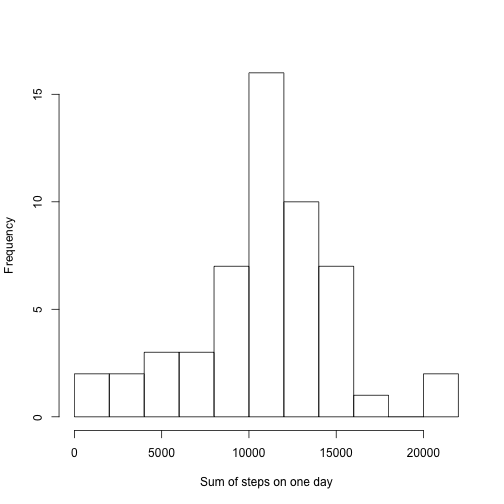
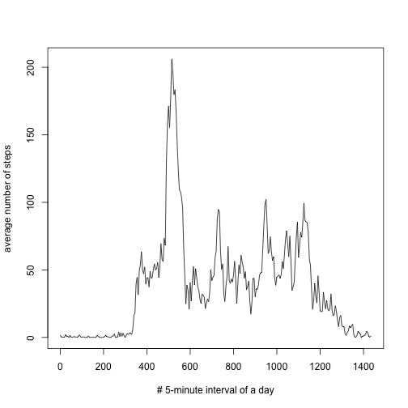
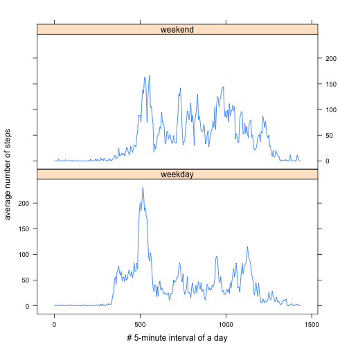

#Reproducible Research - Peer Assessment 1


##How to start and quick overview

1. Download the data ("repdata_data_activity.zip") from the link in the description of this project into the WD and unzip it in order to yield the CSV-file "activity.csv"
2. Read the data into a variable in R:


```r
activity <- read.csv("activity.csv")
```

3. The variable "activity" should contain now 17568 rows/observations and 3 columns called "steps", "date" and "interval". Each of the 61 unique days is divided into 288 intervals of 5-minutes and in each of those intervals the number of steps is either counted or not-available (NA).

4. The format of the column "interval" is a bit problematic, since it's just hour and minute glued together, i.e. 8:40am - 8:45am would become "840" and 1:15pm - 1:20pm would become "1315". Since later a time series should be produced, there would always be strange looking "gaps" when a new hour begins, since e.g. "800" follows "755". I introduce a new column interval_minutes, which contains the n-th minute of each day, from 0 to 1435 (=24 * 60 - 5 = 1440 - 5).


```r
days <- unique(activity$date)
interval_minutes <- seq(0,length(unique(activity$interval)) - 1) * 5
activity <- cbind(activity,interval_minutes)
```

##What is mean total number of steps taken per day?

1. creating a vector ("sum_steps_per_day") containing the total number of steps taken on each day. If there is one NA value occurring during one day, the sum of steps during this day will result in NA:


```r
sum_steps_per_day <- rep(-1,length(days))
for (i in 1:length(days)){
  sum_steps_per_day[i] <- sum(activity$steps[activity$date == days[i]], na.rm = F)
}
```

2. Making a histogram of the sum of the steps per day. NA values in the vector will not contribute to the histogram


```r
hist(sum_steps_per_day, main = "", breaks = 8, xlab = "Sum of steps on one day")
```

 

3. Print mean and median of the number of steps taken per day, ignoring NA values:


```r
paste("Mean:",as.character(round(mean(sum_steps_per_day,na.rm = T),2)))
```

```
## [1] "Mean: 10766.19"
```

```r
paste("Median:",as.character(median(sum_steps_per_day,na.rm = T)))
```

```
## [1] "Median: 10765"
```


##What is the average daily activity pattern?

1. In order to produce a time series averaged over all days of the step values in each of the time intervals, I create a vector of length 288 containing the averaged number of steps taken in each interval. The NA values are not taken into account in this case:


```r
intervals <- unique(activity$interval_minutes)
average_per_interval <- rep(-1.,length(unique(activity$interval_minutes)))
for (i in 1:length(unique(activity$interval_minutes))) {
  average_per_interval[i] <- mean(activity$steps[activity$interval_minutes == intervals[i]], na.rm = T)
}
```

2. Make time series plot of steps in corresponding intervals across all days:


```r
plot(x=intervals,y=average_per_interval, type = "l", xlab = "# 5-minute interval of a day", ylab = "average number of steps")
```

 

3. Find the 5-minute interval in which the maximum number of steps occurs on average:

```r
intervals[which.max(average_per_interval)]
```

```
## [1] 515
```
So the 5-minute interval where on average the maximum number of steps are made is from 8:35am to 8:40am.

##Imputing missing values

1. find out number of rows with one or more NA values:


```r
paste("Number of Rows with NA:",as.character(sum(is.na(activity$steps) | is.na(activity$interval) | is.na(activity$interval_minutes) | is.na(activity$date))))
```

```
## [1] "Number of Rows with NA: 2304"
```

2. the strategy of filling in the NA values is to fill in the mean value of the corresponding 5-minute interval.

3. creating a new dataset "completed_activity" that is equal to the original dataset but with the missing values filled in:

```r
completed_activity <- activity
na_vec <- is.na(activity$steps) | is.na(activity$interval) | is.na(activity$interval_minutes) | is.na(activity$date)
intervals_na <- completed_activity$interval_minutes[na_vec]
indices_intervals_na <- intervals_na / 5 + 1
average_values_na <- average_per_interval[indices_intervals_na]
completed_activity$steps[na_vec] <- average_values_na
```

4. Histogram of total number of steps taken each day calculated from new dataset:


```r
sum_steps_per_day_new <- rep(-1,length(days))
for (i in 1:length(days)){
  sum_steps_per_day_new[i] <- sum(completed_activity$steps[completed_activity$date == days[i]])
}
hist(sum_steps_per_day_new, main = "", breaks = 8, xlab = "Sum of steps on one day from completed dataset")
```

 

5. Print mean and median of the number of steps taken per day from the new dataset:


```r
paste("Mean:",as.character(round(mean(sum_steps_per_day_new),2)))
```

```
## [1] "Mean: 10766.19"
```

```r
paste("Median:",as.character(round(median(sum_steps_per_day_new),2)))
```

```
## [1] "Median: 10766.19"
```

The mean did not change but the median did slightly. Originally the median could only have an integer value, but due to the introduction of mean values in an interval across the days in the "step"-column, this can and did occur.

##Are there differences in activity patterns between weekdays and weekends?

1. Add a new column to the dataset containing info if it is a weekday or a day of the weekend:


```r
weekday <- weekdays(as.Date(completed_activity$date))
weekdayorend <- factor(ifelse(weekday == "Saturday" | weekday == "Sunday", "weekend", "weekday"))
completed_activity <- cbind(completed_activity,weekdayorend)
```

2. Aggregate the data by day type and 5-minute interval to create average number of steps per 5-minute interval. Create a panel plot with the resulting two time series of averaged steps in corresponding 5-minute intervals across the days:


```r
mean_steps <- aggregate(completed_activity$steps, by = list(completed_activity$interval_minutes, completed_activity$weekdayorend), FUN = mean)
names(mean_steps) <- c("interval_minutes","weekdayorend","steps")
library(lattice)
xyplot(steps ~ interval_minutes | weekdayorend, data = mean_steps,type = "l",layout = c(1,2), xlab = "# 5-minute interval of a day",ylab = "average number of steps")
```

 


